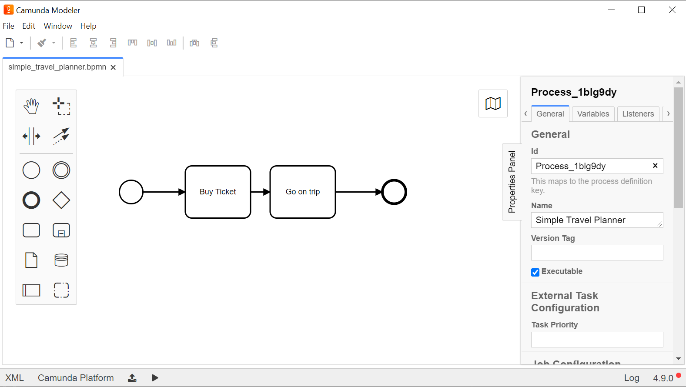

# Creating your first process

## Step 1. (Optional) Understanding the basics
To start your PAIS usage, you should first understand the principles of BPMN modeling. There are many resources online, but we recommend [Jan Mendling's Fundamentals of Business Process Management YouTube playlist](https://www.youtube.com/playlist?list=PL9iw99lS3Prj5VoC4Bwhmj9Wawd2r-Vtt) for newcomers. We at AgileKip also created a [small quiz](https://view.genial.ly/6025550452072e0d9251a95c/game-breakout-bpmn-testing
) reviewing the main concepts.

## Step 2. (Optional) Setting up your modeler of choice

In AgileKip, we mostly use [Camunda Modeler](https://camunda.com/download/modeler/) as our software of choice for modeling, but feel free to choose your own.

A good overview on it can be found [Niall Deehan's series of videos](https://www.youtube.com/watch?v=TlFojzQNopA). Another good resource is Camunda's own [best practices page](https://camunda.com/best-practices/building-flexibility-into-bpmn-models/
) and Camunda Modeler's [documentation](https://docs.camunda.org/manual/7.15/modeler/bpmn/).

## Step 3. Creating a simple model

Load up your modeler of choice. In our case, Camunda Modeler. Now it's time to create a small process.

Let's start of by creating a simple process, one start event, one or two intermediary tasks and one end event. **Make sure to give your process a name, otherwise it will not run!**

Once you have your process ready, save it locally.

## Step 4. Loading your process in PAIS

Go to your PAIS server and login with admin authorisations (use admin > admin). On the top menu, select Entities > Process Definitions.

A new screen will appear showcasing all your processes. Notice that, at least for now, it is empty. Let's change that!

Click on the button saying "Create a new Process Definition" and a new screen will appear. On this one, you will have the option to open the .bpmn file you just created. Select it and click Save.

Now, one or two things will happen. If your process was correctly defined, PAIS will in some seconds to the main Process Defintions page with a green pop-up indicating that the process was correctly loaded.

However, if the process is not correctly defined, the save button will remain grayed out and nothing will happen. If this happens, return to your Maven/local terminal and look at the output. It will display the full stack trace of the program that just attempted to load the problem so you can debug your own BPMN file.

**Tip:** Although PAIS shows its own stack trace and has specific messages for some types of errors (like missing process name), it is not meant to be a BPMN debugging tool. Please ensure that all the models you export into PAIS are valid BPMN processes (have start and end, all tasks are correctly linked etc.).