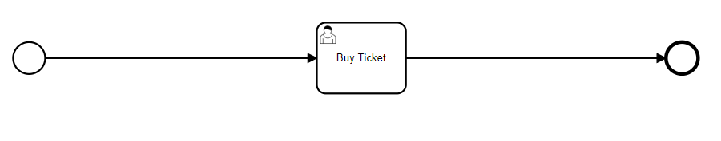
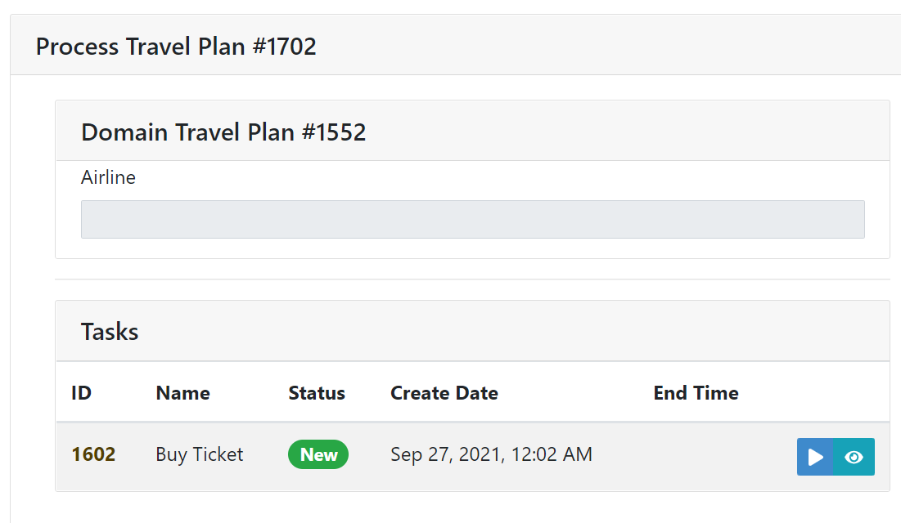
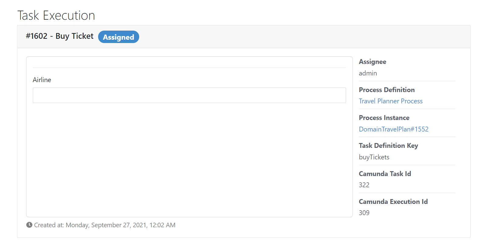
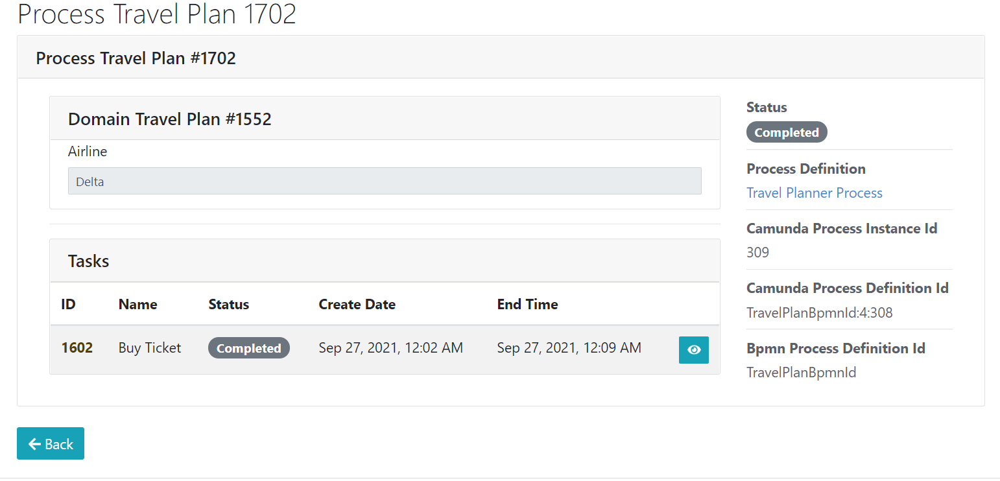

# Creating your first user task

Now that you've finally uncovered how to start-up your PAIS server and how to load your first process, let's understand how to work with the full power of PAIS!

To do so, we're going to create an User Form into our process, which will be understood by PAIS and will, thus, generate a Form into the website that the user can input all of the relevant information for his' or her's processes.

## 1. Setting up the process

Open your BPMN editor, in this example we will use Camunda Modeler.

With your editor, create a sample process with an Start Event, one or multiple User Tasks following into an End Event. You might want to add some process flow but let's keep it simple for now!

**Tip:** In Camunda Modeler you can create an User Task by simply creating a generic task, clicking on it, clicking on the wrench icon and then selecting User Task.

For our trip, let's go for a straight forward demonstration! A single User Task will be enough to showcase how PAIS works.



Once that is done, ensure that you have correctly assigned an unique ID for each Task in your process, as well as an ID for your process itself. It is really important to take note of the ids you assign your process to since it is with them that you'll interface with PAIS.

## 2. Creating the .json files containing the PAIS logic

PAIS works by taking process information that you feed to it using the .bpmn file as well as .json files into actual, usable code. So far, we've talked a lot about the .bpmn files, but what are those .json files?

For those who have never worked with a JSON file, it is a text-based format for storing structured data. In layman's terms, it is just a structure where you put your data into and the software will be able to read and interpret it easily and unambiguously. The JSON structure is quite simple and intuitive, and if you're curious you can read more about it with [DigitalOceans's great article](https://www.digitalocean.com/community/tutorials/an-introduction-to-json).

For almost every object into your BPMN model, we will have an associate .json file with it. This .json will establish critical information about the code to scaffold from this process. For example, it might say which variables are going to be assigned during an User Form or what are the types of those variables.

To work with these files is super easy. Just take the templates which are going to be shown below, change the IDs, names and variables to fit into your process use case and put them into a .jhipster directory inside the root of your PAIS project (the folder you ran `jhipster --blueprint pais --skip-jhipster-dependencies` in the first tutorial).

There are multiple types of .json files but for this "Hello PAIS!" example, we only need to know 4 ones, the first 3 which are universal for every process. So let's start our overview!

### 2.1 The Domain Entity JSON

Our first JSON of note is the Domain Entity. This JSON will host all of the data used by our process instances. As such, this JSON needs to be aware of all of the data that will be used during your process so make note of it!

Let's start with a simple example of a Domain Entity JSON:

```
    {
    "fields": [
        {
        "fieldName": "airline",
        "fieldType": "String"
        }
    ],
    "relationships": [],
    "entityType": "domain",
    "service": "serviceClass",
    "dto": "mapstruct",
    "jpaMetamodelFiltering": false,
    "readOnly": false,
    "pagination": "no",
    "skipFakeData": true,
    "name": "DomainTravelPlan",
    "changelogDate": "20210920183141"
    }
```

This looks quite intimidating at first, but don't worry, most of it is data that deals with JHipster's internal logic! In fact, we only need to be concerned about three elements of this JSON, `fields`, `entityType` and `name`.

In `fields` you'll insert all of the variables that your process will need for execution. They are represented as an array of variables and each variable is an object with a `fieldName` designing its name and a `fieldType` designing its type. For more information on all of the available types, refer to [JHipster's own documentation](https://www.jhipster.tech/jdl/entities-fields).

In `entityType` we will tell PAIS which entity we are creating, in this case, the domain entity. This variable will be changed on the other examples.

In `name` we will establish our Domain Entity variable name. You can set this one to any name that you want, but it is always better to be descriptive to make your program more readable. Please note that as usual with Java programs, **you must name your JSON file with the same name as the name variable**. For example, on this case we established our name as `DomainTravelPlan` and, as such, this JSON should be named DomainTravelPlan.json. Recall that it must be left inside of the .jhipster folder.

## 2.2 The Process Binding Entity JSON

Once your Domain Entity is created, we need to construct yet another entity to bind it with your .bpmn file. This can be done with the Process Binding Entity, also defined via a JSON file. The format is as follows:

```
{
  "fields": [
    {
      "fieldName": "airline",
      "fieldType": "String"
    }
  ],
  "relationships": [],
  "entityType": "process-binding",
  "processBpmnId": "TravelPlanBpmnId",
  "domainEntityName": "DomainTravelPlan",
  "service": "serviceClass",
  "dto": "mapstruct",
  "jpaMetamodelFiltering": false,
  "readOnly": false,
  "pagination": "no",
  "skipFakeData": true,
  "name": "ProcessTravelPlan",
  "changelogDate": "20210920183338"
}
```

Once again, let's ignore the clutter and focus only on the data that we must change. In this case it is as follows:

```
{
  "fields": [
    {
      "fieldName": "airline",
      "fieldType": "String"
    }
  ],
  "entityType": "process-binding",
  "processBpmnId": "TravelPlanBpmnId",
  "domainEntityName": "DomainTravelPlan",
  "name": "ProcessTravelPlan"
}
```

You might remember some of these from the previous Domain Entity! To start of, we tell PAIS this is a process binding entity via setting `entityType` as `process-binding`. We still need to acknowledge the fields in the Process Binding so we can just copy them from the process entity. Likewise, ```domainEntityName``` is rather self-descriptive, it is the name of the Domain Entity we just established moments ago.

One new variable, however, is `processBpmnId`. Remember that in the start of this tutorial we asked for you to take note of the Id given to the global process in your BPMN file. This is precisely why. By setting `processBpmnId` you are now able to do the binding between your .bpmn file and your Domain Entity (referenced by `domainEntityName`)! Wrap everything up by placing an apropriate `name`, name the file with the same name as you put into the variable and let's move forward to the next Entity.

**Important: ** Be sure that you kept the variables that JHipster needs (`relationships`, `service` etc.) into your final version. Even if we do not need to alter these variables, JHipster still needs them for a correct execution. This applies to **all** of the entities.

## 2.3 The Start Form Entity JSON

Once we start a process we must always pass through the StartEvent, where we might add a StartForm. While the form itself is optional, we must add a JSON to tell PAIS what to expect (if he needs to start a form or not, and if so, which information to expect from it).

On our simple example we do not wish to include this behavior, so we can set the following JSON:

```
{
  "fields": [],
  "relationships": [],
  "entityType": "start-form",
  "processBpmnId": "TravelPlanBpmnId",
  "processEntityName": "ProcessTravelPlan",
  "domainEntityName": "DomainTravelPlan",
  "service": "serviceClass",
  "dto": "mapstruct",
  "jpaMetamodelFiltering": false,
  "readOnly": false,
  "pagination": "no",
  "name": "StartFormTravelPlan",
  "changelogDate": "20210401000002",
  "skipFakeData": true
}
```

Once again, let's minify this and focus on the relevant fields.

```
  "fields": [],
  "entityType": "start-form",
  "processBpmnId": "TravelPlanBpmnId",
  "processEntityName": "ProcessTravelPlan",
  "domainEntityName": "DomainTravelPlan",
  "name": "StartFormTravelPlan"
```

By now you're already an expert at PAIS and can easily distinguish all of the different fields. Set your names and ids as in the previous examples, take note that now `entityName` is `start-form` and create an appropriate name for your entity. You might notice that now the `fields` variable is empty and this is no accident, this is our way to tell PAIS that we do not want to set up a Start Form!

Finally, set up a `name`, rename your .json file to it and it's done!

## 2.4 The UserTask Form Entity

And finally, the best for last, you need to set up your UserTask Form Entity. The process is similar to all the previous, start by using this sample .json file:

```
{
  "fields": [
    {
      "fieldName": "airline",
      "fieldType": "String"
    }
  ],
  "relationships": [],
  "entityType": "user-task-form",
  "processBpmnId": "TravelPlanBpmnId",
  "processEntityName": "ProcessTravelPlan",
  "taskBpmnId": "buyTickets",
  "domainEntityName": "DomainTravelPlan",
  "service": "serviceClass",
  "dto": "mapstruct",
  "jpaMetamodelFiltering": false,
  "readOnly": false,
  "pagination": "no",
  "skipFakeData": true,
  "name": "TaskBuyTickets",
  "changelogDate": "20210401000004"
}
```

And as always, mentally remove the JHipster clutter and focus only on the relevant fields:

```
{
  "fields": [
    {
      "fieldName": "airline",
      "fieldType": "String"
    }
  ],
  "entityType": "user-task-form",
  "processBpmnId": "TravelPlanBpmnId",
  "processEntityName": "ProcessTravelPlan",
  "taskBpmnId": "buyTickets",
  "domainEntityName": "DomainTravelPlan",
  "name": "TaskBuyTickets"
}
```

We have a new field for our UserTask called `taskBpmnId`. This fields binds the information of this JSON with the Task with the given ID from your .bpmn file. This is where you substitute the ID you took note earlier in this example in order to make the Task binding work! Finally, you have `fields` which, finally, will tell you which fields are those that you will want to add to the form. Since we only established a single field into our domain entity (airline), let's just add it into our form.

## 3. Scaffolding using JHipster

Once all your JSONs are correctly named, you can proceed to the scaffolding process. Let's go over it step by step:
1. Make sure that all of your JSONs have all of the fields (including the JHipster fields we did not alter)
2. Make sure that all of the variables that reference external entities (ex: `domainEntityName`, `processEntityName`) reference the correct names.
3. Make sure the same is happening for your variables that reference IDs (ex: `processBpmnId`, `taskBpmnId`), make sure that all of these Ids exist and have the correct names.
4. Ensure that each JSON's `name` variable matches the name of the JSON file itself. For example, a JSON with a name of `TravelPlan` must be named TravelPlan.json
5. Ensure that the Domain, Process Binding and Start Form JSONs exist! All three are necessary to correctly execute a process.
6. Move all of the .json files into the .jhipster folder inside the root of your project folder (the folder you ran `jhipster --blueprint pais --skip-jhipster-dependencies` in the first tutorial).
7. Open up Docker and move to the root of your project folder.
8. Run the command `jhipster entity [INSERT_NAME_OF_DOMAIN_ENTITY_HERE]` to begin the scaffolding. For example: jhipster entity DomainTravelPlan
9. Answer "yes" to regenerate all files and select "a" to replace all
10. On an external terminal (outide docker) move to your project folder and execute `./mvnw`. You will now compile a new server with your scaffolded folders!

## 4. Executing your process

Now load up your server into your browser, sign-in and go towards Entities > Process Definitions. Once there press "Create a new Process Definition" and upload your .bpmn file.

Now a new row has appeared with the process you just uploaded. Click on the "Init" button. A new window will pop up, press on "Start" and a new Process Instance will start up.

On this new window, you can already see the information you specified into your JSON. Notice the airline field available there!



Click on the blue play button and you'll be forwarded into the UserTask Form, now you can write any value in the form. Congratulations, you've built your first UserForm!



Write your new value for the airline variable and proceed. You'll now notice that the information is now filled!



## 5. Next Chapter

Now that you know your way around PAIS basics, you might want to try slightly more sophisticated examples. Why not one with multiple UserTasks and a Start Form? Also, you might have noticed that our UserForm is not much of a form at all? Where are all the information? How do we add them? On the next tutorial, we will explain all of this into a more sophisticated variation of the Travel Plan