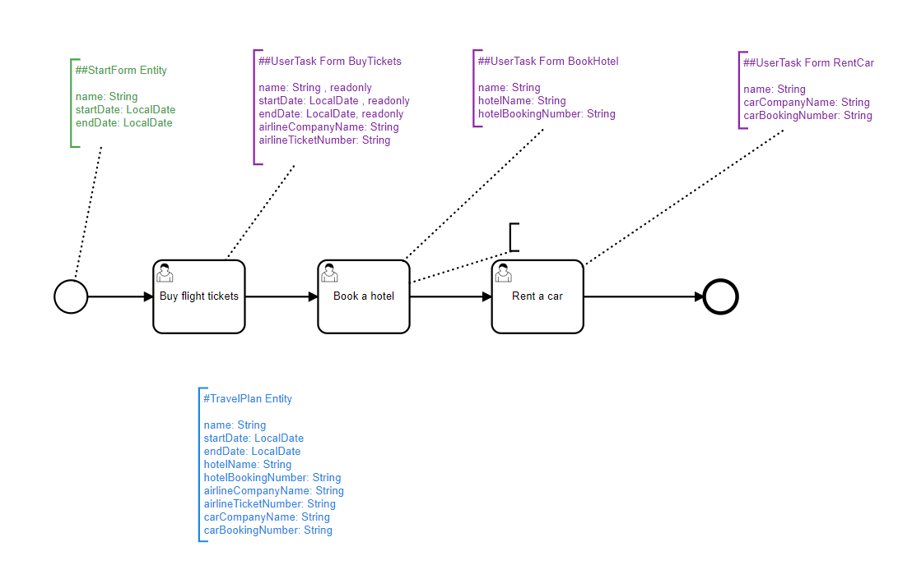

# Complex User Tasks

Now that you've learned how to set-up the User Task, you might wonder how to relay information about the process more clearly to the end-user, especially regarding the parts of the process where you will need user intervation.

On this tutorial, we are going to go over how to create a process with multiple user tasks with different types of data, as well as how to write informative descriptions to your users for their tasks.

## Setting up Descriptions

When formalizing a process under BPMN, you might want to relay some information to your user to guide them during the filling of their tasks, or even at the start of the process.

For example, in our Travel Planning case, you might want to greet the users by displaying the following information in your screen:

```
Planning a trip can feel like both the most exciting AND the most overwhelming part of travel.

Sure, creating a Pinterest board full of gorgeous pictures is fun, but then you start trying to figure out the actual logistics and it hits you … oh god, this is SO MUCH WORK. Cue panic attacks.*Wow, I totally just described our wedding planning process, too. Anyone else?


But planning a trip doesn’t have to be the source of constant anxiety and overwhelm! Through the years, I’ve perfected my trip planning process, and I’ve got it down to a fine science.


Er, well, maybe not a science, but sort of like a general step-by-step outline.  

Breaking down each of the steps to planning a trip helps me cut through the confusion and tackle stuff in a practical, down to earth way.

So, this travel plan process aids you in this mission and consists of the following tasks:

Buy Flight Tickets
Book a Hotel
Rent a Car
```

Notice that the first Task is the moment to set up a good onboarding of the user onto your process, as well as to provide critical information that they might not be aware of. 

However, this text seems a little bit bland by itself. Thankfully, PAIS supports Markdown so you can spice it with a nicer formatting by using the [simple Markdown conventions](https://www.markdownguide.org/basic-syntax/).

```
# Planning a Trip


**Planning a trip can feel like both the most exciting AND the most overwhelming part of travel.**
Sure, creating a Pinterest board full of gorgeous pictures is fun, but then you start trying to figure out the actual logistics and it hits you … oh god, this is SO MUCH WORK. Cue panic attacks. *Wow, I totally just described our wedding planning process, too. Anyone else?*


But planning a trip doesn’t have to be the source of constant anxiety and overwhelm! Through the years, I’ve perfected my trip planning process, and I’ve got it down to a fine science.


Er, well, maybe not a science, but sort of like a general step-by-step outline.  
**Breaking down each of the steps to planning a trip helps me cut through the confusion and tackle stuff in a practical, down to earth way.** 


So, this travel plan process aids you in this mission and consists of the following tasks:

1. Buy **Flight** Tickets
1. Book a **Hotel**
1. Rent a **Car**
```

Once your description is ready, you can write it into the **Element Documentation** field of your BPMN editor. On Camunda, it will be located under Properties Panel -> Documentation -> Element Documentation.

**Tip:** You can do this process not only for User Tasks, but for the process itself. Try writing an element documentation on your general process (the scope where you set-up your Process Definition key) to give an overview of the entire process like we did here. Then, you can reserve the descriptions of the tasks for the more nuanced details a task might need.

## Multiple Task Processes

Once you have your task descriptions ready, you might want to move towards a more sophisticated process. In our Travel Planner example, we might look towards something like this:



Notice how even in this simple example we already have lots of trailing variables going everywhere. It is important that this complexity is well managed and why it is so important to both to the correct process modeling and to properly document your activities. 

In AgileKIP, we recommend a standardized TextAnnotation for each activity citing all of the used variables. It will really help creating the JSONs!

Talking about JSONs, let's go over into how to create them for this process. You might notice that the process is very similar to our previous UserTask example so let's show only some tasks:

```
{
  "fields": [
    {
      "fieldName": "name",
      "fieldType": "String",
      "fieldReadOnly": true
    },
    {
      "fieldName": "startDate",
      "fieldType": "LocalDate",
      "fieldReadOnly": true
    },
    {
      "fieldName": "endDate",
      "fieldType": "LocalDate",
      "fieldReadOnly": true
    },
    {
      "fieldName": "airlineCompanyName",
      "fieldType": "String"
    },
    {
      "fieldName": "airlineTicketNumber",
      "fieldType": "String"
    }
  ],
  "relationships": [],
  "entityType": "user-task-form",
  "processBpmnId": "TravelPlanBpmnId",
  "processEntityName": "ProcessTravelPlan",
  "taskBpmnId": "TaskFlight",
  "domainEntityName": "DomainTravelPlan",
  "service": "serviceClass",
  "dto": "mapstruct",
  "jpaMetamodelFiltering": false,
  "readOnly": false,
  "pagination": "no",
  "skipFakeData": true,
  "name": "TaskBuyTickets",
  "changelogDate": "20210401000004"
}
```

Inside of the Task to buy flight tickets, we now have a fieldReadOnly boolean. This is to tell that the field must not be modified on this activity.

```
{
  "fields": [
    {
      "fieldName": "carCompanyName",
      "fieldType": "String"
    },
    {
      "fieldName": "carBookingNumber",
      "fieldType": "String"
    }
  ],
  "relationships": [],
  "entityType": "user-task-form",
  "processBpmnId": "TravelPlanBpmnId",
  "processEntityName": "ProcessTravelPlan",
  "taskBpmnId": "TaskCar",
  "domainEntityName": "DomainTravelPlan",
  "service": "serviceClass",
  "dto": "mapstruct",
  "jpaMetamodelFiltering": false,
  "readOnly": false,
  "pagination": "no",
  "skipFakeData": true,
  "name": "TaskRentCar",
  "changelogDate": "20210401000004"
}
```

Note as well that the Task that rents a car is very straight forward. Editing the JSONs is simple and by now you should already be an expert. Try yourself creating a new step in this process and create a JSON youself. (If you need an idea, why not "Book Museum Tickets"?)

## Scaffolding and Running the Process

Proceed to Scaffold the JSONs as did previously and restart the server. Load your BPMN file as usual and initialize the process, now you might see a new greeting:


Notice your new process greeting with the formatted Markdown. It was that easy!

Also notice that the variable names will unnest from the CamelCase and format automatically into a regular space separated format. This is convenient since you need only to worry about giving a correct variable name and the representation will be managed by PAIS.

After intializing your process you will be greeted by a process overview:


Which in turn will show you the Task Execution UI with your description for the given Task once it's running:


## Conclusion

You're now able to set up complex User Forms for a linear process. You can start to build an user-friendly process execution tool. On the next guide, let's see how to integrate User Input with real code using ServiceTasks!