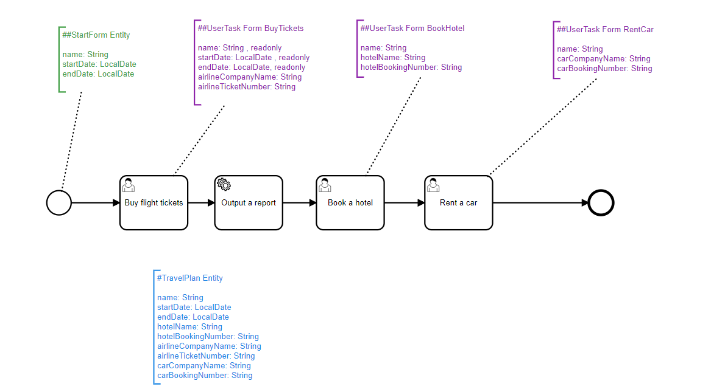
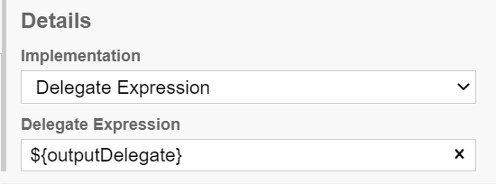
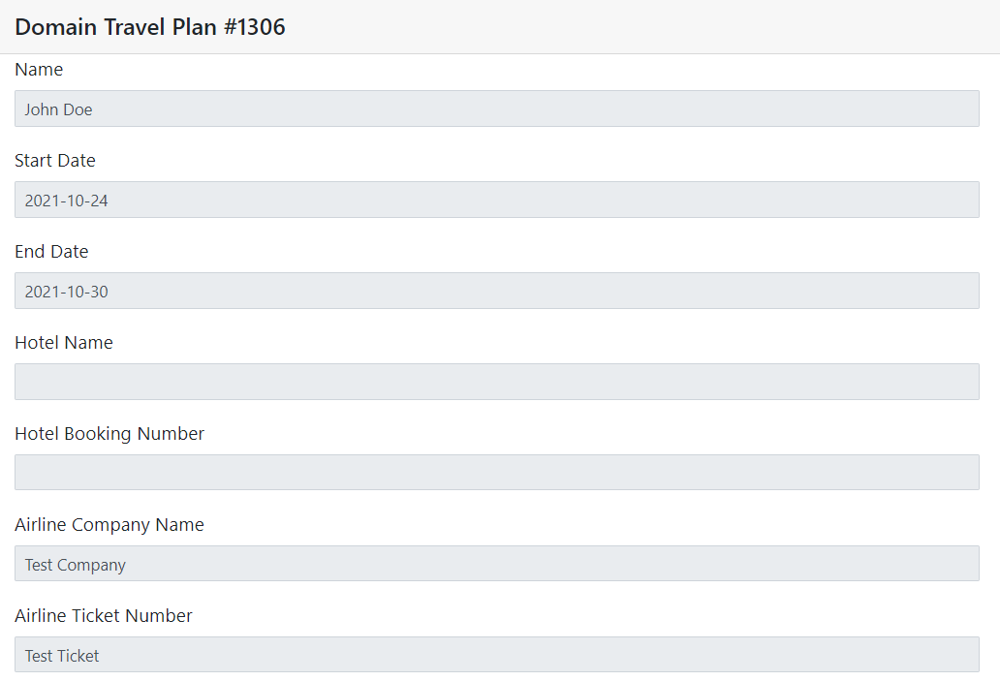
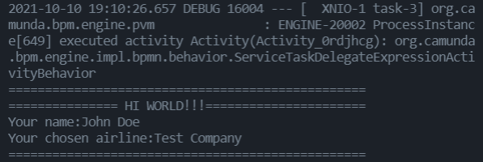

# Integrating Java Code into your Processes with Service Tasks

By this point in our tutorial services, you should be well familiarized with PAIS and how to set-up interactive forms to your users with detailed explanations about the process flow and the data to be fed. 

The next step is to use this Data as you desire, to do any arbritary operation on it using Java. It might look hard, but with the usage of Service Tasks and Delegate Functions you will see how this is even easier than you think.

## Setting up Service Tasks

Before thinking about executing code, you should first think of when, in your process flow, you need to execute code. Maybe an API call after an user form? Or a simple output validating an user input? The code execution should be integrated into the process flow, happening before or after a given activity.

Once the correct timing for the code to be executed has been established, insert an Activity containing a Service Task into your process flow. In our example, we will create a code to print into the console a report containing the variables inserted by the user on the process setup and the user task.



Service Tasks do not need JSONs since they won't be scaffolded directly, but instead it will be you who will provide the code for them. Thus, we will create a Delegate Expression that will be called once the process arrives at this Service Task.



Notice that on the delegate expression we will create a token like `${outputDelegate}`. **Ensure that this expression is in CamelCase and that the first letter is in lower case.**

And that's simply it! Now let's move on to the implementation of this Delegate.

## Setting up the Delegate

Move to your project folder and scaffold all JSON files you might have. Once done, go to src/main/java/[your organization name]. There, create a delegates folder and put inside of it .java files for each Delegate you created in your process. In our case, that will be only OutputDelegate.java:

![images/guide_5/delegates_folder.PNG]

Notice how on this time the first letter is in **upper case**. This is important and you might have issues executing your function if it's incorrectly named.

Now for this example we will use a simple mock, just printing on console the information from the process:

```
package com.mycompany.myapp.delegates;
import org.camunda.bpm.engine.delegate.DelegateExecution;
import org.camunda.bpm.engine.delegate.JavaDelegate;
import org.springframework.stereotype.Component;

import com.mycompany.myapp.service.dto.ProcessTravelPlanDTO;

@Component
public class OutputDelegate implements JavaDelegate {
    @Override
    public void execute(DelegateExecution delegateExecution) throws Exception {

        ProcessTravelPlanDTO pi = (ProcessTravelPlanDTO) delegateExecution.getVariable("pi");        
        String name = pi.getDomainTravelPlan().getName();
        String airline = pi.getDomainTravelPlan().getAirlineCompanyName();
        
        System.out.println("=================================================");
        System.out.println("=============== HI WORLD!!!======================");
        System.out.println("Your name:" + name);
        System.out.println("Your chosen airline:" + airline);
        System.out.println("=================================================");
    }
}
```

In the file, create your OutputDelegate component by inheriting from JavaDelegate. There override the execute process while receiving a DelegateExecution object. This object contains the **process instance variable** that contains getters for all information from your process. You can access it by the following line:

```
ProcessTravelPlanDTO pi = (ProcessTravelPlanDTO) delegateExecution.getVariable("pi");
```

Inside of the Process Instance, you can get the Domain for your process by the method .get[YOUR DOMAIN NAME] and from it, the variables from .get[VARIABLE NAME].

```
String name = pi.getDomainTravelPlan().getName();
String airline = pi.getDomainTravelPlan().getAirlineCompanyName();
```

And that is all you need to interact with your process. Take a look into the DTO file for more information on all of the given methods if you wish, otherwise just move forward to implementing your Java code using the process information. In our case, we will simply execute a print in the console with the user inputs.

## Running the Service Task

Once this is done, recompile your server by executing the `mvnw` file. Follow the procedures as usual, intializing the process and filing the UserTasks as demanded. 



Once you reach the Service Task, PAIS will automatically execute your code! In our example, you can check out the printed lines with the user provided input from the console of the server:



And that's all for the Service Tasks!

On the next tutorial, we will talk about yet another feature of PAIS, dealing with Gateways and Branches.