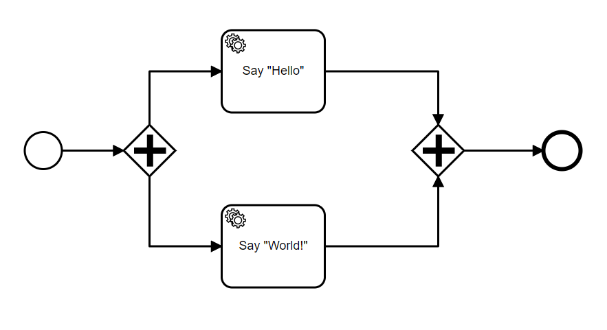

# Introducing concurrence with Parallel Gateways

On this guide, we will present how you can add concurrence to your processes using Parallel Gateways.

To showcase this, let's create a process that starts and then immediately splits into two branches. To keep it simple, these two branches will just be two ServiceTasks, one which will print Hello and another, World. Finally, a final gateway will receive these two tasks and output the result.

Let's create this process under PAIS by defining the Domain, Process Binding and StartForm JSONs. Once done, scaffold inside of the Docker container and once that's finished, execute Maven.

As usual, once the server is up, upload your .bpmn file with a parallel gateway. Once that's done, hit execute.

You will notice that as soon as the process starts its execution, the two ServiceTasks will be instantly called! Go back to the terminal running your server and you're going to see the following messages:

Our concurrent Hello World has worked! Setting up parallel gateways is simple but key towards making more advanced processes.

On the next chapter, we are going to discuss how to spice things up even further. We are going to explain how to set Event-Based gateways, where Events happening in concurrent paths inside of a process (or even outside of a process!) can be acknowledged and cause changes in your process execution.