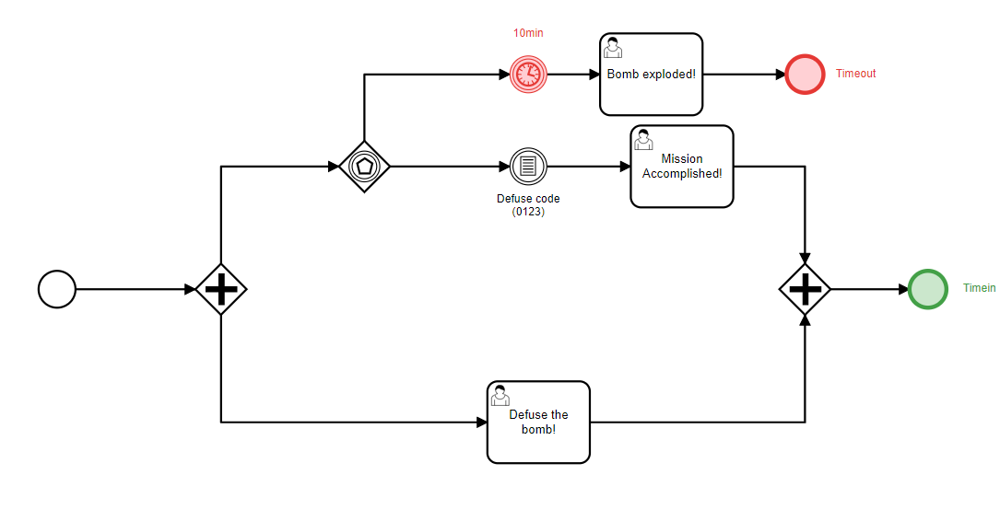

# Dealing with Events using the Event Based Gateway

In the last chapter of our PAIS Guides series, we are going to discuss Event Based Gateways.

Event Based Gateways are Gateaways that will stop a process flow until an event happens and a condition is satisfied.

For example, imagine a process where you apply for a job. After you send a CV (filling a job, UserTask), you will now wait until the external entity (the company you applied for) sends a follow-back e-mail (event), contaning the status of your application (interview or dismissal). Note that while you might wait indefinetely, you might also timeout after some time.

Let's create a game with this new rules. We are going to defuse a time-bomb! Using the Parallel Gateway, let's create two flows in the process: 

One flow is for the user and will deal with the bomb defusal mechanism, the user has a small puzzle to follow and to try to input the code into a UserTask. 

The other flow is the bomb, there an Event Gateway will listen to the code inserted by the user and if it is correct, disarm the bomb! If the user is unable to find the code before a certain time-limit, it is game over, and the bomb will explode!

One way to model this process in BPMN is like this:

Let's create some JSONs to store the logic not only for the process, but also for the Code the user will input. We are going to encode it as a variable "Code" which takes a String as type.

Once that is done, scaffold inside of the container and compile Maven. Then, upload your BPMN file and start executing the time-bomb process!

Because of the Parallel Gateway, the flow of execution will call the UserTask and the Event Based Gateway, the later which will wait for the user to type the code. Go ahead and try to solve the puzzle yourself! If you're struggling, you can see the solution on the BPMN file above.

And that is it for the Event Based Gateway! With it you can push your creativity even further, as now there's no limit to what types of events you might want to follow. Have fun exploring with PAIS and good luck modeling and executing your processes!