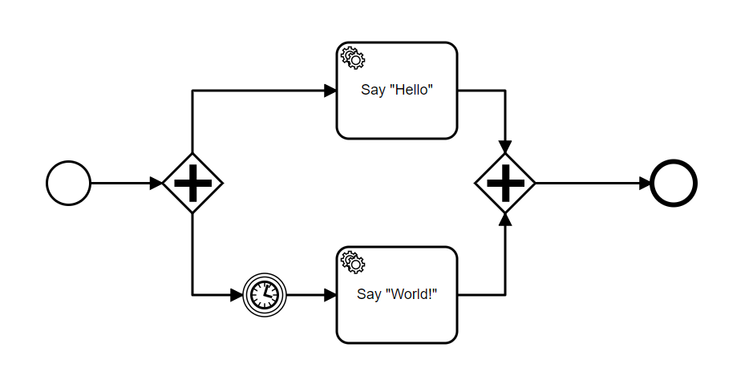

# Adding a Sleep Timer into your processes

Sometimes, you don't just want to run processes immediately. If you know in advance how long your process must wait, it can be very useful to insert a timer into it, pausing execution until the designated time is finished.

PAIS support this feature using BPMN's own timers! Let's showcase how this works using our previous example of parallel gateway. To recall, we created a simple, parallel Hello World! process by making one branch of the gateway say Hello while another says World!. Our process looks like this:

Now, since we're talking about a parallel execution you might realise that the branches run at the same time and, thus, we might have a scenario where World is printed before Hello. While we want to output Hello World, we must admit that World Hello is not at all the same thing!

To deal with this lets introduce a timer on World in order to tell PAIS to wait for some seconds before outputting World. In BPMN terms, this means creating an Intermediate event just before the Say "World!" event. After creating the event, press on the Wrench (in case of Camunda Modeler) and transform this event into a Timer event. You should have your process as follows:

Now we need to set up the logic of this timer, click on it and open its Properties Panel. You will have an automatically assigned Id on the timer while you can leave it as is, it might be interesting to give it an descriptive Id to better document your process.

Notice a Section called Details, which presents a Timer Definition Type with three possibilities, Date, Duration and Cycle. For our use case, the most appropriate one is Duration, so let's choose that one. Below this there's a Timer Definition, which takes an input. For type, you will want to add an [ISO 8601 compliant time string](https://en.m.wikipedia.org/wiki/ISO_8601). In our use case we don't need to wait long, just 5 seconds will do the trick. Therefore, we finalize this timer by inserting the ISO 8601 representation of waiting for "five seconds later": PT5S. Your final timer will look like this:

Now everything's ready! Simply upload this process into PAIS and it will take care of everything for you, timer and all! If you're curious about the process and the setup necessary to run it on PAIS, especially the Parallel Gateway and the Delegate Functions to output the Hello World! messages, check out the previous tutorial on Parallel Gateways!